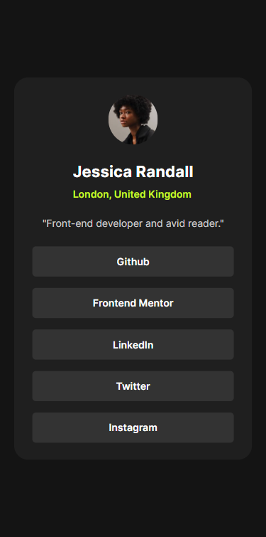
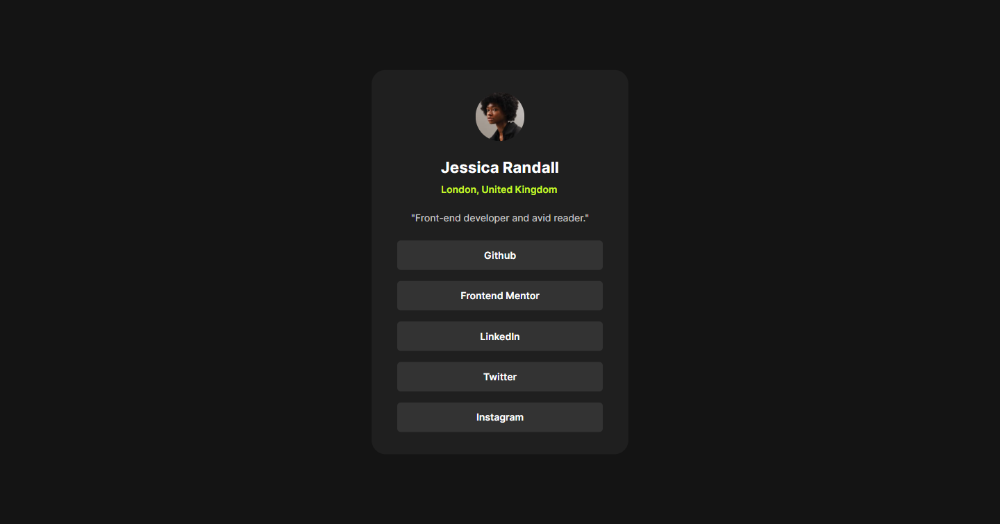
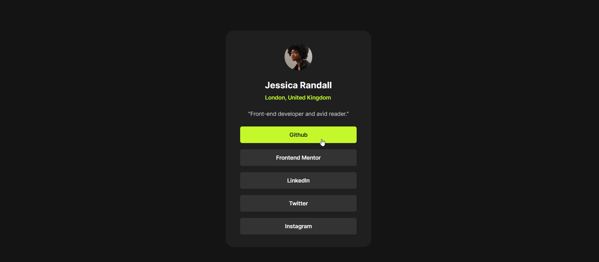

# Social links profile

This is a solution to the [Social links profile](https://www.frontendmentor.io/challenges/social-links-profile-UG32l9m6dQ).

## Table of contents

- [Overview](#overview)
  - [The challenge](#the-challenge)
  - [Screenshot](#screenshot)
- [My process](#my-process)
  - [Built with](#built-with)
  - [Useful resources](#useful-resources)
- [Author](#author)

## Overview

### The challenge

Users should be able to:

- See hover and focus states for all interactive elements on the page

### Screenshot
- Mobile: 

- Destkop:

- Hover stats:

## My process

- Start by reviewing the user's instructions and understanding what was required.
- Create a new repository in Github.
- Initialize git, create an HTML file called `index.html`.
- Set up the project structure using HTML5 semantic tags.
- Install and Add Sass in order to preprocess the css into a stylesheet.
- Add CSS stylesheet link to my html document and began writing basic styling.
- Create a responsive layout based on the provided design mock.
- Use media queries to adjust the font size and spacing accordingly.
- For accessibility purposes, I added ARIA roles and labels to each element.
- Add Animation to links.
- Finally, I made sure that the site is fully accessible by testing it with various browsers and devices

### Built with

- Semantic HTML5 markup
- CSS custom properties
- Flexbox
- Mobile-first workflow
- Responsive design
- Sass
- ParcelJS
- Animation

### Useful resources

- [Sass](https://sass-lang.com/) - Sass is the most mature, stable, and powerful professional grade CSS extension language in the world.
- [Parceljs](https://parceljs.org/) - Parcel combines a great out-of-the-box development experience with a scalable architecture that can take your project from just getting started to massive production application.

## Author

- Github - [Github](https://github.com/amrmabdelazeem)
- Frontend Mentor - [@amrmabdelazeem](https://www.frontendmentor.io/profile/amrmabdelazeem)
